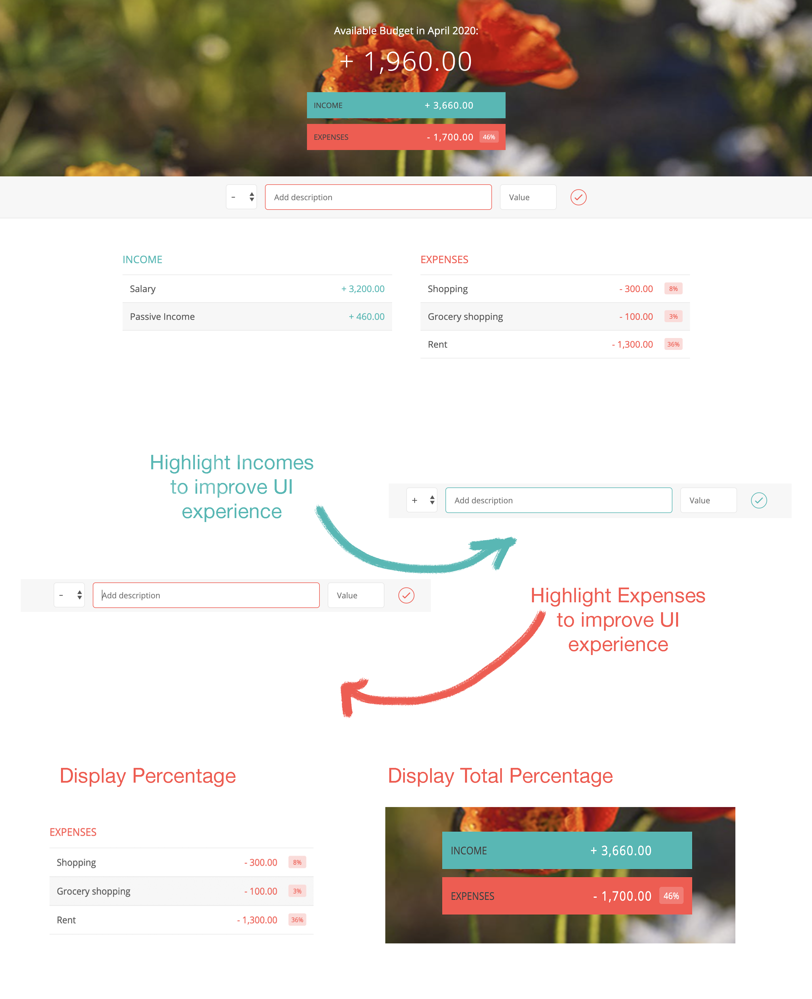

# Budget-Controller-App
Hello everyone!
It's a Budget Controller Web Application where you can add your income and expenses and it'll calculate how much budget you have for the month.
It'll also change the background image according to the current month.
 

Project is from Udemy "JavaScript Complete Course".
